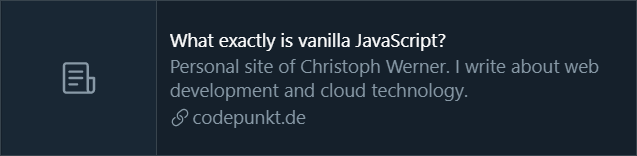
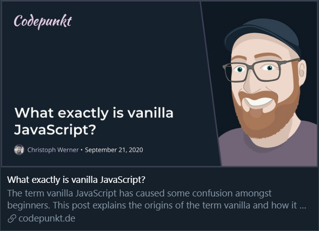
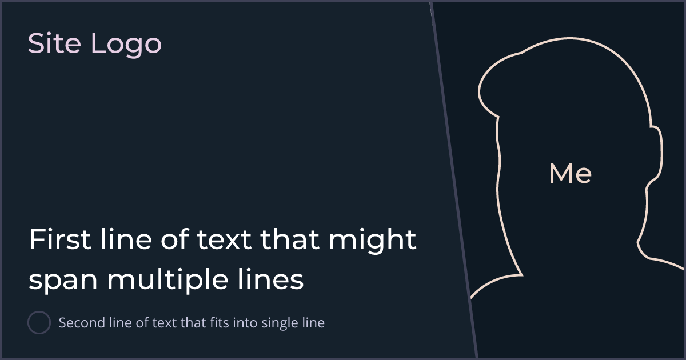

## What is Open Graph?

When you share a link on a social network or chat app, [Open graph](https://ogp.me/) makes it "unfold" into an image, title, and description. This happens on a lot of platforms like Facebook, Twitter, WhatsApp, Discord, Slack and others.

Open graph was created by Facebook in 2010 and **standardizes the use of metadata representing the content of a website**. If your website is shared, you’ll want to present the contents of your page in an optimal way to encourage people to pay a visit.

If you don't have open graph metadata, the platforms where your website is shared will make a best effort to create a preview of your content. A blog post from this site shared on Twitter **without open graph metadata** looks like this:



Unfortunately, your content will not stand out next to other content that is posted with open graph metadata. A link to the same blog post, but this time **with open graph metadata** could look like this instead:



Compared to the previous one, this will catch people's attention.

### How to create open graph metadata

The open graph metadata is provided as `html•<meta>` tags in your website's `html•<head>`. The four required properties for every page are

- **og:title** is the title of your page.
- **og:type** is the type of page. The default is _"website"_, but alternatives like _"article"_, _"profile"_ or _"video"_ are also available.
- **og:image** is an image URL that represents your page.
- **og:url** is the URL of the page.

Other tags that can be worth adding are **og:description**, **og:locale** and **og:site_name**. Some platforms have their own extensions with additional tags like **twitter:card**, others have [validator tools](https://developers.facebook.com/tools/debug/) that you can use to check how your links would look like when shared.

Most of the open graph tags are text-based and thus easy to add. The one with the largest impact however, is the **og:image** tag.

## Auto-generating open graph images

If you decide to use open graph meta tags for your site and would like to have **images that match the content of specific pages**, manually creating all of these images would be time consuming and error prone:

- You'd have to remember to create a new open graph image for every post that you write and every new page that you add.
- Open graph images would be likely to run out of sync with your content whenever you change something.

To avoid these drawbacks, I was looking for a way to generate open graph images for blog posts and other content that I publish to this [Gatsby](https://www.gatsbyjs.com/) site. After throwing together a design in Adobe Illustrator, I knew the open graph images for my blog posts should look like this:


I derived some requirements from this design. I want to provide a background image that stays the same across all open graph images. I want to be able to add flexible text parts on top, set in a specific font and color to match this website's typography:

- The title (large font)
- The date (small font, _optional_)

Libraries that generate open graph images exist both in a Gatsby-specific context and as generic Node.js implementations. Most of them fall into one of these two buckets:

### Option 1: Take screenshots in a browser

[Puppeteer](https://pptr.dev/) and [Playwright](https://playwright.dev/) are great browser automation tools for Node.js. They can be used to **start a browser and open a website**. If the website is designed to look like the desired open graph image, we can then tell the browser to **take a screenshot** of it.

If we want to create multiple open graph images for different posts, we can create a templated website for our open graph image and **fill in each posts metadata** as we need. From a design perspective, this approach is _very_ flexible―you can basically design everything that's possible with HTML and CSS. Admittedly, this approach has some downsides:

1. **Performance suffers**. Spawning and then automating a lot of browser instances is a rather unwieldy approach when you create hundreds of open graph images.
2. The browser automation tools **don't run seamlessly in every environment**. Both your development and your production build pipeline will have to work with the tool of your choice.

Several libraries and services use this approach, most notably [gatsby-plugin-printer](https://www.npmjs.com/package/gatsby-plugin-printer) and Vercel's [og-image service](https://github.com/vercel/og-image).

The browsers automated by these packages are native dependencies, which can be hard to set up with a single configuration in a variety of environments. Because I want to be able to generate my open graph images on macOS, Windows and Linux, I decided to not pursue this direction any further.

### Option 2: Use an image processing library

We can use Node.js image processing libraries that support typography to create the open graph images for us. [Jimp](https://www.npmjs.com/package/jimp) is written entirely in JavaScript **without any native dependencies**. However, it only supports bitmap fonts.


This is problematic, because bitmap fonts can’t be styled or scaled without quality loss―a font file is needed for every combination of font size, color and weight. [gatsby-remark-social-cards](https://www.npmjs.com/package/gatsby-remark-social-cards) is one of the libraries that uses Jimp to create open graph images.

Other image processing libraries require native dependencies or use native Node.js addon modules. On installation, these native addon modules are either compiled or pre-compiled binaries for the target platform are downloaded. They can be as hard to set up in a variety of environments as native dependencies are, so all libraries using one of these approaches are out of the question.

These include [gm](https://www.npmjs.com/package/gm), which is an API wrapper that requires one of the native dependencies `imagemagick` or `graphicsmagick` to be installed and [node-canvas](https://www.npmjs.com/package/canvas), a cairo-backed Canvas implementation for Node.js.

## Implementing my own solution

I couldn’t find an existing solution that met my requirements, so I planned on building my own solution.

Then I came across Alessia Bellisario's article ["Building a Gatsby Plugin with Wasm"](https://aless.co/gatsby-wasm-plugin/) and was intrigued: She ran into the same problems and also implemented her own solution, [gatsby-remark-twitter-cards](https://www.npmjs.com/package/gatsby-remark-twitter-cards).

It allows us to render two texts on top of a background image, one at the top, the other one at the bottom. We can configure TrueType fonts as well as custom colors and font-sizes for both of them.

Awesome! 💜



However, to be able to generate open graph images based on my design, this is not enough.

1. We need both texts at the bottom
2. The first text needs to grow upwards when it spans multiple lines
3. Both texts are not allowed to grow to the width of the full image

The text rendering and layout in `gatsby-remark-twitter-cards` is done by [wasm-twitter-card](https://www.npmjs.com/package/wasm-twitter-card). This package is written in [Rust](https://www.rust-lang.org/), compiled to [Wasm](https://webassembly.org/) and published as an NPM package. It uses a _crate_ (which, in the Rust world, is another name for "package") named `glyph_brush_layout` to do the actual text rendering.

### Compiling Rust to WebAssembly

`wasm-twitter-card` has rather inflexible API. As the underlying crate can layout text inside a bounding box both horizontally and vertically, I decided to implement my own Wasm package on top of it.

To do so, I had to learn a tiny bit of Rust and the basics of both [wasm-pack](https://crates.io/crates/wasm-pack) and [wasm-bindgen](https://crates.io/crates/wasm-bindgen), which are at the core of compiling Rust to Wasm.

In order to create a more flexible API, there would've been a total of 12 parameters. Rust neither supports default argument values nor overloading method signatures with a different number of parameters, so I decided to implement a few structs to _group_ related parameters:

```rust {numberLines}
#[wasm_bindgen]
pub struct Dimension {
    width: i32,
    height: i32,
}

#[wasm_bindgen]
impl Dimension {
    // function being bound should translate to
    // calling the "new" operator in JavaScript
    #[wasm_bindgen(constructor)]
    pub fn new(width: i32, height: i32) -> Dimension {
        Dimension { width, height }
    }
}
```

Using these structs as parameters, the `render` method is called with 5 arguments, which is a lot clearer:

```rust {numberLines}
#[wasm_bindgen]
pub fn render(
  text: &Text,
  size: &Dimension,
  bounds: &Dimension,
  position: &Position,
  alignment: &Alignment,
) -> Vec<u8> {
  // ...
}
```

I published the resulting package as [@codepunkt/wasm-layout-text](https://www.npmjs.com/package/@codepunkt/wasm-layout-text). It offers a `render` method that you can use to get rendered text as an `UInt8Array` of pixels and supports:

- [x] TrueType fonts with configurable size and color
- [x] Text positioning and a customizable text bounding box
- [x] Any combination of vertical and horizontal alignment
- [x] Custom image dimensions

### Using `@codepunkt/wasm-layout-text`

In order to use the package, call the `render` method and create new configuration objects for text, image dimensions, text bounding box, text position and text alignment with the `js•new` keyword.

```js {numberLines}
const { readFileSync } = require('fs')
const { join } = require('path')
const wlt = require('@codepunkt/wasm-layout-text')

const color = new wlt.RgbColor(91, 214, 123)
const font = readFileSync(join(__dirname, 'myfont.ttf'))

const buffer = wlt.render(
  new wlt.Text('Hello world', 64, color, font),
  new wlt.Dimension(1200, 630), // image dimension
  new wlt.Dimensions(1100, 530), // text bounds
  new wlt.Position(50, 50),
  new wlt.Alignment(
    wlt.HorizontalAlign.Left,
    wlt.VerticalAlign.Top,
  ),
)
```

If you are unsure where to get TrueType fonts, take a look at the [Font file repository](https://github.com/google/fonts) of [Google Fonts](https://fonts.google.com/). They have a lot of open source fonts hosted there.

You can then proceed to write the resulting buffer to a file, for example with `jimp`:

```js {numberLines}
const Jimp = require('jimp')

await new Jimp({ data: buffer, width: 1200, height: 630 })
  .quality(100)
  .writeAsync(join(__dirname, `result.png`))
```

### Using `gatsby-remark-opengraph`

In order to generate open graph images for my [homepage](/) as well as individual ones for every blog post, **I created a Gatsby plugin** that uses `@codepunkt/wasm-layout-text` to layout texts and `jimp` to compose any number of them with a background color or image.

**It is called [gatsby-remark-opengraph](https://www.npmjs.com/package/gatsby-remark-opengraph)** and is added to the remark plugins array of your `gatsby-config.js` to generate open graph images for your markdown content.

This is a simplified version of what I'm using for this site:

```js {numberLines}
{
  resolve: 'gatsby-remark-opengraph',
  options: {
    background: require.resolve(
      './src/assets/og-image-background.png'
    ),
    outputPath: (node) => path.join(
      './public',
      node.fields.path
    ),
    texts: [
      {
        text: (node) => node.frontmatter.title,
        color: '#ffffff',
        font: require.resolve('./src/assets/Montserrat.ttf'),
        verticalAlign: 'bottom',
      },
      {
        text: (node) =>
          new Date(
            node.frontmatter.published
          ).toLocaleDateString('en', {
            day: 'numeric',
            month: 'long',
            year: 'numeric',
          }),
        color: '#ffffff',
        fontSize: 32,
        font: require.resolve('./src/assets/OpenSans.ttf'),
        verticalAlign: 'bottom',
      },
    ],
  },
}
```

If you want to use the plugin without Gatsby or generate additional open graph images for your Gatsby site, use the `createImage` export.

It takes the same options as the remark plugin, but function options are called with `js•null` instead of a markdownNode so it's a good idea to provide strings for `outputPath` and `text`.

```js {numberLines}
const { createImage } = require('gatsby-remark-opengraph')

await createImage({
  // if no outputPath and filename are defined, image is
  // created at ./public/og-image.jpg
  background: require.resolve(
    './src/assets/og-image-background.png',
  ),
  texts: [
    {
      text: 'Hello world!',
      color: '#ffffff',
      font: require.resolve('./src/assets/Montserrat.ttf'),
      verticalAlign: 'bottom',
    },
  ],
})
```

This code snippet above is a simplified version of the one I use in my `gatsby-node.js` to generate a generic open graph image for my homepage. What's left to do is actually inserting the open graph `html•<meta>` tags into your site, in Gatsby this is typically done using `react-helmet`.

## Conclusion

Thanks to Alessia for paving the way and sparking my interest at Rust! 🦀

I implemented a wrapper around an existing Rust crate. This wrapper is compiled to Wasm using `wasm-pack` and `wasm-bindgen` and has been published as NPM package [@codepunkt/wasm-layout-text](https://www.npmjs.com/package/@codepunkt/wasm-layout-text).

In order to generate open graph images for this site, I implemented the Gatsby plugin [gatsby-remark-opengraph](https://www.npmjs.com/package/gatsby-remark-opengraph) that can combine a background image with multiple texts.

My key takeaways are:

- Rust is a very interesting language with which I've only scratched the tip of the iceberg. It has introduced me to quite a few new concepts.
- If your site is statically generated, it is a good idea to generate open graph images at build time.
- You can use `@codepunkt/wasm-layout-text` as a native, dependency-free solution to generate images with TrueType text in Node.js
- If you are working with Gatsby, you can use `gatsby-remark-opengraph` to create beautiful open graph images

I learned a lot and hope you also learned a thing or two. Thank you for reading!
