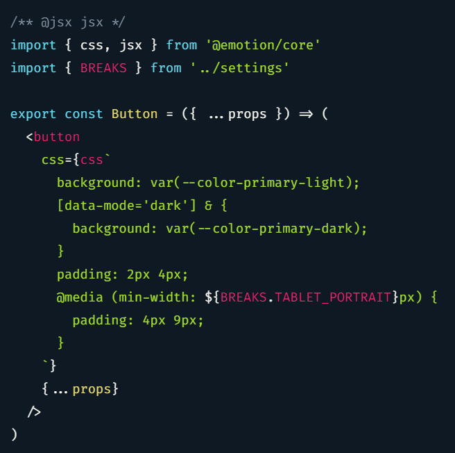

## Run-time solutions

The first thing that comes to mind is to use a JavaScript library like [Prism](https://prismjs.com/) to do syntax-highlighting on the client. Most of these libraries are RegExp- instead of AST-based. This means:

1. Their filesize can be quite small, which is good for the performance of your website. According to [Bundlephobia](https://bundlephobia.com/result?p=prismjs) the current version `1.21.0` at the time of writing this blog post is 16kb in size.
2. They might produce some failures when highlighting your source code. If you don't have overly complex code snippets, this might not happen a lot and be negligible.

Because the analysis of your code snippets is done in the browser, the HTML code with your code snippets has to be downloaded first before the library can analyze it. This can lead to FOUC, showing your **non-highlighted source code** for a brief moment, before the library is able to enable the syntax highlighting.

## Build-time solutions

Because [Gatsby](https://www.gatsbyjs.com/) generates static sites, **analysis and highlighting can be done on the server at build-time**. No additional JavaScript library has to be sent to the browser, which is awesome!

### Running prism at build-time

The most commonly used library to perform syntax highlighting at build time with Gatsby today is [gatsby-remark-prismjs](https://www.npmjs.com/package/gatsby-remark-prismjs) - an official plugin.

JavaScript code highlighted with it and the _"okaidia"_ theme for the dark mode of this site looks like this:



It works fine and performs great because the highlighting is done at build time. However, you can see a few quirks in the example:

- The `BREAKS` variable imported from the `../settings` module is highlighted differently than the `css` and `jsx` variables.
- Highlighting of embedded CSS in JavaScript doesn't work. It is treated as a regular template string.

The plugin **does not take full advantage of the build-time scenario** because it uses Prism under the hood, which is designed to run in the browser and therefore only has a limited range of functionality.

### Libraries that are designed for build-time usage

Syntax highlighting libraries that were designed to run in the browser have to be fast and lightweight due to their target environment. If you use a plugin at build-time, the constraints of the browser environment don’t apply.

This means that syntax highlighting libraries can be _designed_ to run at build-time and **make different tradeoffs**. If you wanted to highlight unusual things like CSS in JavaScript, this isn't possible with any of the traditional libraries designed for the browser (see example above).

#### gatsby-remark-vscode

Since [Visual Studio Code](https://code.visualstudio.com/) is built with web technology and has incredible syntax highlighting capabilities, [Andrew Branch](https://blog.andrewbran.ch/) decided to make the syntax highlighting of VSCode available for gatsby sites with his library [gatsby-remark-vscode](https://www.npmjs.com/package/gatsby-remark-vscode).

This allows you to use VSCode extensions like syntax highlighting themes or language definitions and get the same syntax highlighting in your Gatsby site that you would otherwise have in your editor.

It's what is currently used on this blog and has has many amazing features like

- Line number toggle, highlighting of specific lines
- Diff highlighting to highlight changes
- Switch between dark & light mode, change when specific media queries or parent selectors are matched (e.g. high contrast mode)
- Highlighting inline code with an inline code marker and then using that code marker by writing something like `` `js»const answer = 42` `` to get highlighted inline code like `js•​const answer = 42`.

Amongst all of this goodness, the feature that I like best is that you can use any VSCode extension that make changes to the syntax highlighting. To have nice CSS-in-JavaScript syntax highlighting in VSCode, i use an extension called [vscode-styled-components](https://marketplace.visualstudio.com/items?itemName=jpoissonnier.vscode-styled-components).

To set this up on this site I added that extension to my Gatsby project and then configured `gatsby-remark-vscode` to use it. I had to install it directly from GitHub because it's not published as an NPM package. I've also added [slack-theme](https://marketplace.visualstudio.com/items?itemName=felipe-mendes.slack-theme) for both light and dark mode themes using the same mechanism and configured them accordingly.

My current options for `gatsby-remark-vscode` in `gatsby-config.js` look like this:

```js {numberLines}
theme: {
  default: 'Slack Theme Ochin',
  parentSelector: {
    'html[data-mode=dark]': 'Slack Theme Dark Mode',
  },
},
inlineCode: {
  marker: '»',
},
extensions: ['slack-theme', 'vscode-styled-components']
```

With this configuration and a little extra styling, the source code from the screenshot in the [chapter above](#running-prism-at-build-time) looks like this:

```jsx {numberLines}
/** @jsx jsx */
import { css, jsx } from '@emotion/core'
import { BREAKS } from '../settings'

export const Button = ({ ...props }) => (
  <button
    css={css`
      background: var(--color-primary-light);
      [data-mode='dark'] & {
        background: var(--color-primary-dark);
      }
      padding: 2px 4px;
      @media (min-width: ${BREAKS.TABLET_PORTRAIT}px) {
        padding: 4px 9px;
      }
    `}
    {...props}
  />
)
```

As you can see, this is much more consistent and readable.

#### shiki and twoslash

Another syntax highlighting library that I've contributed to in the past is called [Shiki](https://github.com/shikijs/shiki). It works with VSCode themes and languages and is used in both the VSCode website as well as the TypeScript website.

You can use Shiki in your Gatsby site by using [gatsby-remark-shiki](https://www.npmjs.com/package/gatsby-remark-shiki). However, `gatsby-remark-vscode` described above has more features as of today and is nicely maintained, so it is my preferred choice.

If you take a look at [specific parts](https://www.typescriptlang.org/docs/handbook/basic-types.html#tuple) of the TypeScript website, you will see that their code snippets not only have nice syntax highlighting, but also have TypeScript type annotation tooltips and TypeScript error checking. This functionality is provided by a library called [twoslash](https://www.npmjs.com/package/@typescript/twoslash).

If you're going to have a lot of TypeScript code snippets, you can use [gatsby-remark-shiki-twoslash](https://www.npmjs.com/package/gatsby-remark-shiki-twoslash). This package combines Shiki with Twoslash and is used in the TypeScript website.

## Conclusion

**If you do static site generation, it is a good idea to also perform your syntax highlighting at build time. Use libraries that are designed for this use-case, because they make different tradeoffs than build-time libraries.** This results in more accurate syntax highlighting and a lot more features that you can put to good use on your site.

For Gatsby, my preferred solutions are:

- [gatsby-remark-vscode](#gatsby-remark-vscode), which is currently used on this site
- [gatsby-remark-shiki-twoslash](#shiki-and-twoslash), if you're interested in additional TypeScript features

It's a pity that these are only available as "Gatsby Remark" plugins instead of just "Remark" plugins. If the latter was the case, they could be used with other tools for static site generation in JavaScript, like [Next.js](https://nextjs.org/) or [Eleventy](https://www.11ty.dev/).
