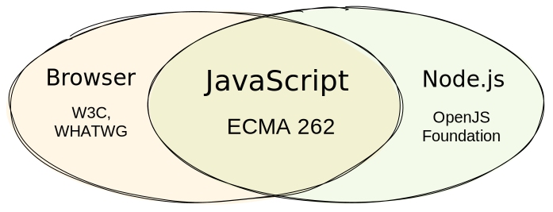

## The term _vanilla_

The term _vanilla_ originates from the traditional standard flavor of ice cream, vanilla flavor. It's an adjective that describes the simplest version of something, without any optional extras.

Various computing-related things like software, hardware or algorithms are called _vanilla_ when they are not customized, but remain in their original, basic form. In this usage context, the word _vanilla_ is used synoymously to the words _ordinary_ or _standard_:

> Having no special or extra features; ordinary or standard.
>
> &mdash; <cite>[Oxford English Dictionary](https://www.lexico.com/definition/vanilla)</cite>

## What's included in _vanilla JavaScript_?

There is no official definition of _vanilla JavaScript_ or _vanilla JS_. These terms refer to the language itself, without any external additions like libraries, frameworks or other packages. Because JavaScript is standardized as ECMAScript, _vanilla JavaScript_ includes the standard language features described in the [ECMA-262 specification](https://tc39.es/ecma262/).

Additional APIs are assumed to be present when programming JavaScript, depending on the context.

1. JavaScript in a browser

   When JavaScript is running in the browser, additional [Web APIs](https://developer.mozilla.org/en-US/docs/Web/API) like the DOM and CSSOM or the fetch and canvas APIs are available.

2. JavaScript in Node.js

   When JavaScript is running in Node.js, additional [Node APIs](https://nodejs.org/docs/latest/api/) like HTTP or the file system API are available.

Because both Web and Node APIs are not external additions, JavaScript code using them is typically also considered _vanilla JavaScript_. The combination of Node.js APIs and the ECMAScript standard is sometimes referred to as _vanilla Node_.

## It's not a framework

The term _vanilla JS_ is often used as a joke to remind other developers that a lot of things can be easily done without the need for additional JavaScript libraries or packages.

There's even a website that builds upon this joke by attempting to market _vanilla JS_ as a "very fast framework". Even though reminding developers that a lof of things can be done without using additional libraries, this is **very** confusing to beginners.

Don't get confused! _Vanilla JavaScript_ is **not** a framework.
